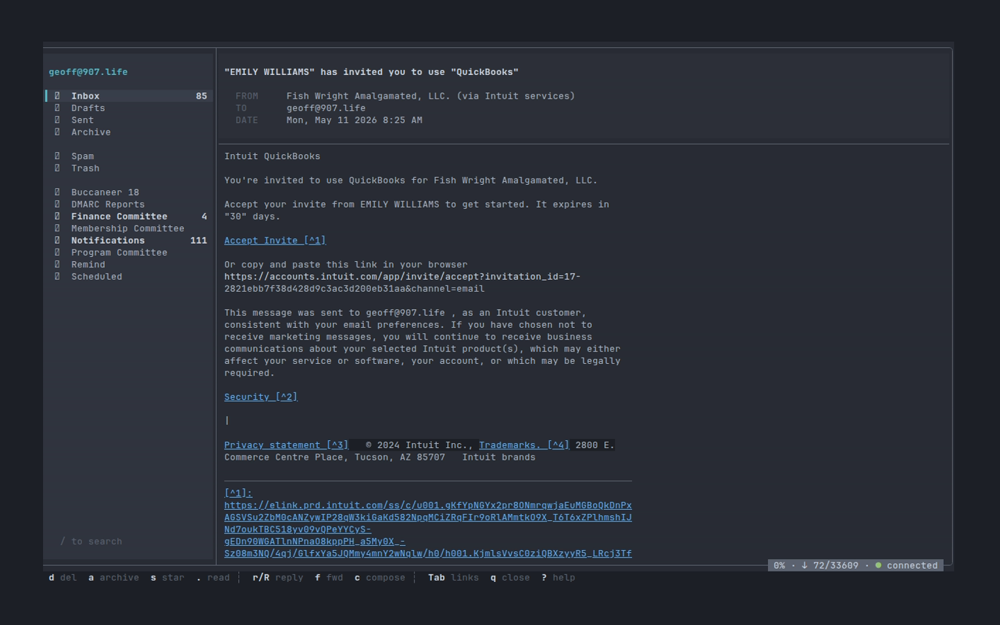

# poplar

[](LICENSE)

*A modern TUI mail client with all the fixin's.*

<p align="center">
  
</p>

## Status

poplar is in **beta soak**. Data formats are frozen at `v0.9.0`;
only bug-fix releases land on the `v0.9.x` line until `v1.0`.
The release model is documented in [ADR-0105](docs/poplar/decisions/0105-release-stance.md).

Coming after v1.0: native OAuth for Gmail / Outlook IMAP
([#42](BACKLOG.md)) and a Neovim companion plugin
([#6](BACKLOG.md)).

## Features

Every feature you expect from a modern desktop mail client, in 80×24.

- **Threaded conversations.** Depth-aware prefix walker, in-place expand/collapse, search-results mode that keeps thread structure.
- **Cross-folder search.** SQLite FTS5 with an operator vocabulary: `from:`, `to:`, `cc:`, `subject:`, `in:`, `has:attachment`, quoted phrases. The sidebar `\` key toggles folder scope.
- **Compose with catkin.** A markdown-first bubbletea editor with live styling, soft wrap, 50-step undo/redo, find/replace, smart Enter, list indent, bracket matching, and an embedded SymSpell spellchecker. Contacts autocomplete from CardDAV. Attachments, scheduled send, undo send, multiple identities and signatures.
- **Contacts.** CardDAV sync into the local cache, a T9-grouped sidebar, edit form. Address autocomplete in compose, contact popovers in the reader.
- **Attachments.** Viewer chip row, `@` picker for inline display, `Ctrl+O` in compose to attach.
- **Outbound delivery.** Outbox state machine on top of a per-account SQLite queue. Undo send (10s default), schedule send, optimistic UI — sent messages appear immediately, the drainer reconciles on completion.
- **Themes.** 15 built-in compiled themes, One Dark by default. No runtime TOML, no glamour. Palette-to-surface map lives in [`docs/poplar/styling.md`](docs/poplar/styling.md).

## What's distinctive

- **mailrender** — `internal/content` + `internal/filter` build a lipgloss block model for message bodies. Plain text *and* HTML render through one structured pipeline. No glamour dependency, no shelling out to pandoc or w3m.
- **First-class markdown support.** Compose writes markdown; the wire carries `multipart/alternative` with text and HTML synthesized by goldmark (Linkify + Tables enabled).
- **tidytext.** `Ctrl+T` in compose hands the current draft to an AI rewrite step. User-invoked, never silent. Changes apply in place.
- **Full JMAP.** Direct on [`rockorager/go-jmap`](https://git.sr.ht/~rockorager/go-jmap). Atomic `Email/import` + `EmailSubmission/set` in one request. Native push (no polling on Fastmail).
- **Local cache + outbox.** Per-account SQLite with background body backfill, lazy attachment storage, a typed-op queue for all mutations, and a drainer with a conflict matrix. Offline-tolerant; UI never blocks on the network.

## Quickstart

```bash
go install github.com/glw907/poplar/cmd/poplar@latest
poplar
```

On first run, poplar detects the missing config and launches an
interactive wizard. The wizard walks you through provider
selection, credentials, and a connection test, then writes
`~/.config/poplar/config.toml`.

### Provider notes

- **Fastmail (JMAP).** Generate an API token at
  [fastmail.com → Settings → Privacy & Security → API tokens](https://app.fastmail.com/settings/security/tokens),
  paste it into the wizard. Native JMAP push means no IDLE
  reconnect loops; submission and Sent placement land atomically.
- **Gmail (IMAP).** v0.9.0 uses XOAUTH2 via your own `password-cmd`
  helper that prints a fresh access token (the wizard explains the
  shape). Native OAuth with BYO client ID
  ([#42](BACKLOG.md)) lands in v1.1 — the wizard's provider row is
  there now and will route to a "Sign in with Google" flow once
  the OAuth subsystem ships.
- **Generic IMAP.** Presets cover iCloud, Yahoo, Zoho, Outlook,
  mailbox.org, Posteo, Runbox, GMX, and ProtonMail (Bridge on
  loopback). Self-hosted IMAP works with explicit `host`/`port`
  plus `insecure-tls = true` for self-signed certs.

Validate your config end-to-end before launching:

```bash
poplar config check
```

The command runs the IMAP probe, SMTP probe (or JMAP session
probe), and reports each step.

## Keybindings

vim-first, modifier-free single keys. No Ctrl/Alt sequences in
the core key map.

| Key | Action |
|-----|--------|
| `j` / `k` | Move down / up in the message list |
| `Enter` | Open the focused message |
| `q` | Close reader / back to list |
| `r` / `R` | Reply / Reply-all |
| `f` | Forward |
| `c` | Compose new |
| `D` | Move to Trash |
| `M` | Move to… (folder picker) |
| `/` | Search |
| `?` | Help popover |

Full key map: [`docs/poplar/keybindings.md`](docs/poplar/keybindings.md).

## Architecture

- **Single Go module, single binary** — `cmd/poplar` plus
  `internal/`. No plugins, no subcommands beyond `config` and
  `diagnose`.
- **bubbletea v2** throughout — `charm.land/bubbletea/v2`,
  `lipgloss/v2`, `bubbles/v2`. Strict Elm architecture: state in
  models, mutations only in `Update`, I/O in `tea.Cmd`. Showcase
  build for the v2 stack.
- **Direct on emersion** — `go-imap` v2, `go-smtp`, `go-webdav`,
  `go-vcard`, plus `rockorager/go-jmap`. No aerc fork.
- **Modern Go 1.26** — slices/maps/iter/slog idioms throughout
  (ADR-0196). Vet, gofmt, and the project's voice check are commit
  gates.

Deeper architecture references:

- [`docs/poplar/system-map.md`](docs/poplar/system-map.md) —
  package layout and data flow
- [`docs/poplar/invariants.md`](docs/poplar/invariants.md) —
  binding facts
- [`docs/poplar/decisions/INDEX.md`](docs/poplar/decisions/INDEX.md) —
  ADR archive

## Configuration

One file: `~/.config/poplar/config.toml`. Self-documenting
template. The wizard writes it on first run; hand-editing is
welcome and round-trips through `poplar config check`.

Themes are picked by name in the `[ui]` table — see
[`docs/poplar/styling.md`](docs/poplar/styling.md) for the
palette-to-surface map.

## Building from source

```bash
git clone https://github.com/glw907/poplar.git
cd poplar
make install
```

Targets:

- `make build` — compile to `./poplar`
- `make test` — run the test suite
- `make check` — fmt-check, vet, voice check, modern-go check, test (commit gate)
- `make install` — install to `~/.local/bin/poplar`

## Contributing

Poplar is solo-maintained pre-1.0. Issues and feature requests
live in [`BACKLOG.md`](BACKLOG.md); the `make check` gate is the
contract for any change. Broader contribution norms (PR shape,
CI workflow, `CONTRIBUTING.md`) land alongside v1.0 prep
([#41](BACKLOG.md), [#40](BACKLOG.md)).

## License

MIT — see [`LICENSE`](LICENSE).
